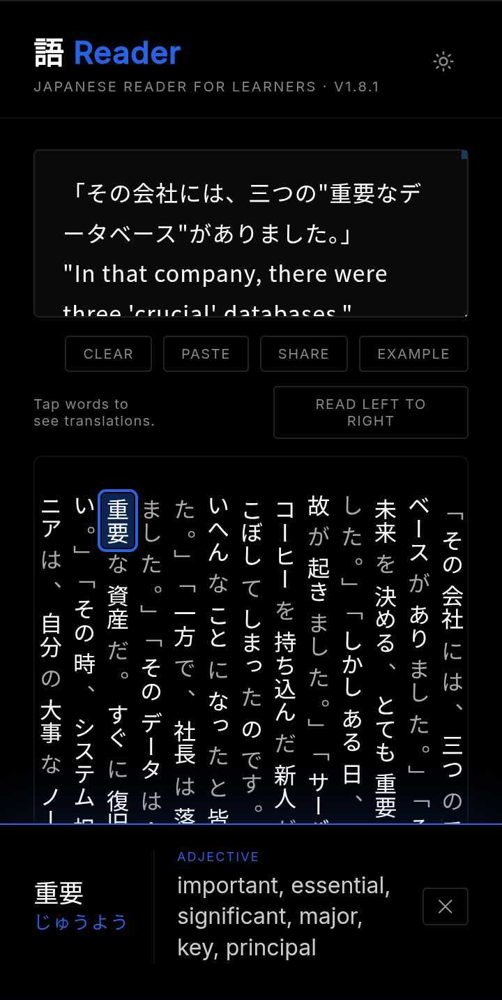
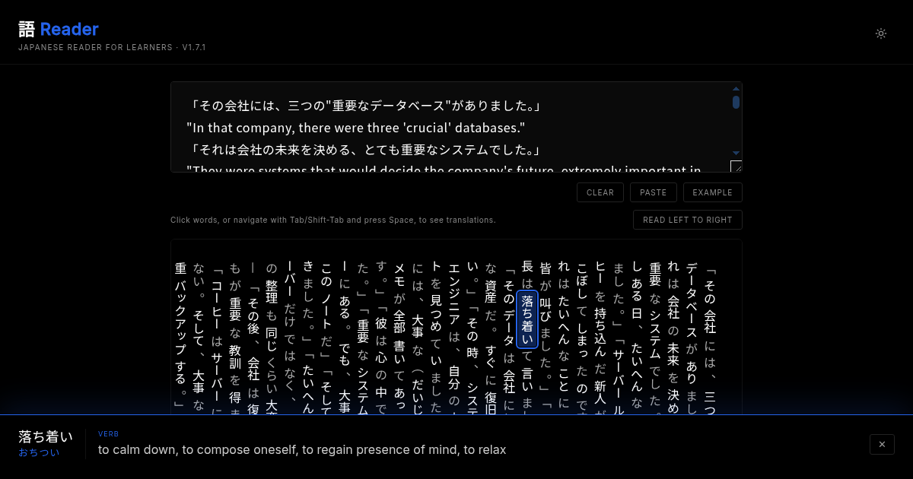

# 語 Reader — Japanese Reader For Learners

A free Japanese reading tool for advanced learners. Type or paste Japanese text and tap
any morpheme to instantly see its hiragana reading and English meaning.
Look up kanji, vocabulary, and grammar while reading native Japanese content.

<br>
*語 Reader on mobile.*

<br>
*語 Reader on desktop.*

Everything runs in the browser — no account, no server, no API calls, **no AI**.

**[https://nevdelap.github.io/go-reader/](https://nevdelap.github.io/go-reader/)**

## Features

- **Instant morpheme lookup** — click or tap any morpheme in Japanese text to see its reading and English definition
- **Hiragana readings** — see how any word is pronounced
- **Offline-capable** — works without an internet connection
- **Light and dark modes** — follows your system preference, or can be set manually
- **Mobile-friendly** — works on phones and tablets
- **Welcome overlay** — introduction for first-time visitors
- **Free and open source** — no sign-up, no server, no ads, no tracking\*

*\*Counts users by country so I can see how much use it is getting.*

## How it works

- **Tokenization** — [kuromoji.js](https://github.com/takuyaa/kuromoji.js), a
  pure JavaScript Japanese morphological analyzer
- **Dictionary lookups** — [JMdict](https://www.edrdg.org/jmdict/j_jmdict.html),
  the Electronic Dictionary Research and Development Group's Japanese-English
  dictionary, bundled as a compact gzipped JSON file

See [docs/architecture.md](docs/architecture.md) for a detailed breakdown.

## Licenses

- App code: [MIT](LICENSE)
- Dictionary data: [CC BY-SA 4.0](LICENSE-JMDICT) — © Electronic Dictionary
  Research and Development Group
- kuromoji.js: browser build from the [kuromoji npm package](https://www.npmjs.com/package/kuromoji),
  [Apache 2.0](LICENSE-KUROMOJI) — [NOTICE.md](NOTICE.md) is included from the package as required by
  Apache 2.0, though it covers mecab-ipadic dictionary data, not kuromoji
- Lucide icons: [ISC](LICENSE-LUCIDE)

## Local development

```bash
just serve    # serve locally and open in browser
just format   # format Markdown
just lint     # format then lint
```

## Maintaining the repository

Periodically update the dictionary in compliance with its license and rewrite
history to keep the repo lean.

Install `git-filter-repo` if not already installed using your package manager,
e.g.:

```bash
# Linux (Debian/Ubuntu)
sudo apt install git-filter-repo

# macOS
brew install git-filter-repo
```

Then run:

```bash
scripts/update_jmdict_and_compact_repo.sh
```

The script checks for a new JMdict release, downloads it if one is available,
rebuilds the compact dictionary, rewrites git history to remove old dictionary
blobs, and prompts before force-pushing.

Note: GitHub will also periodically run its own garbage collection on the server
side, which helps over time, but won't rewrite history to remove old blobs —
that requires the steps above.
